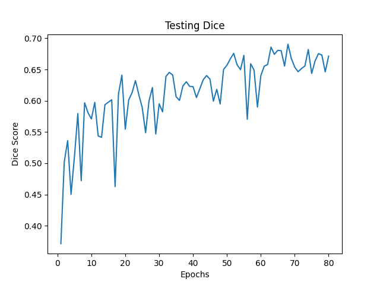
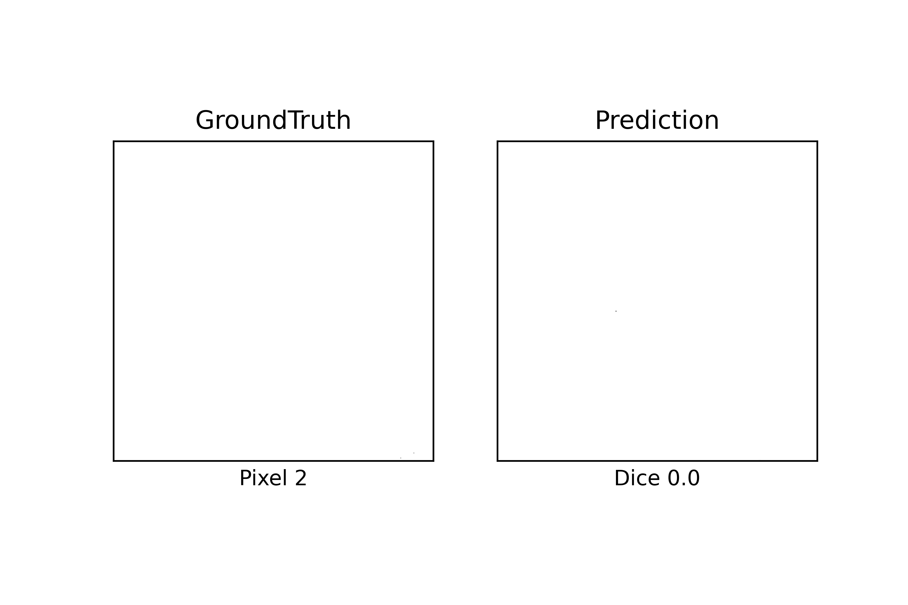
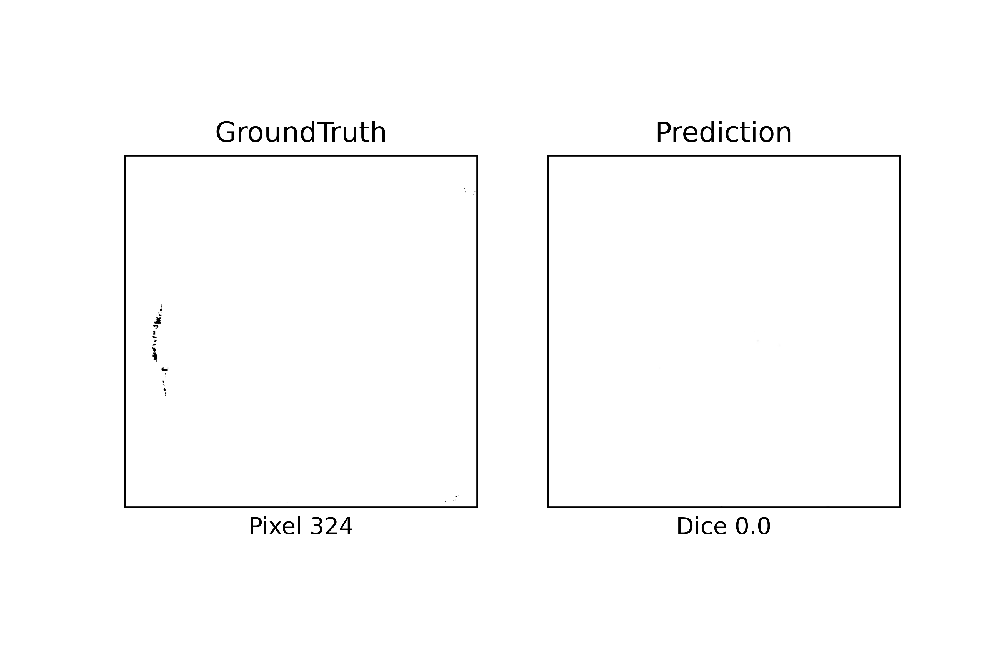
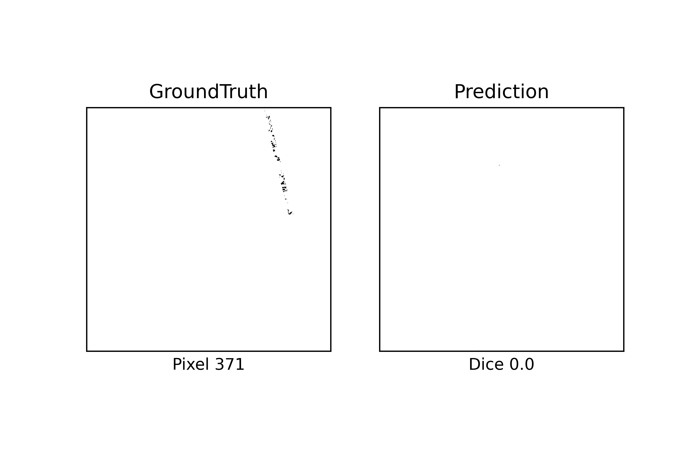
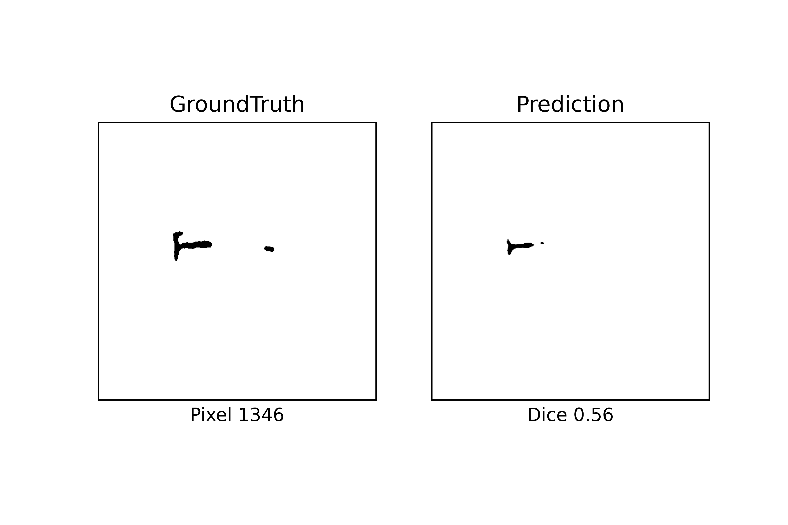
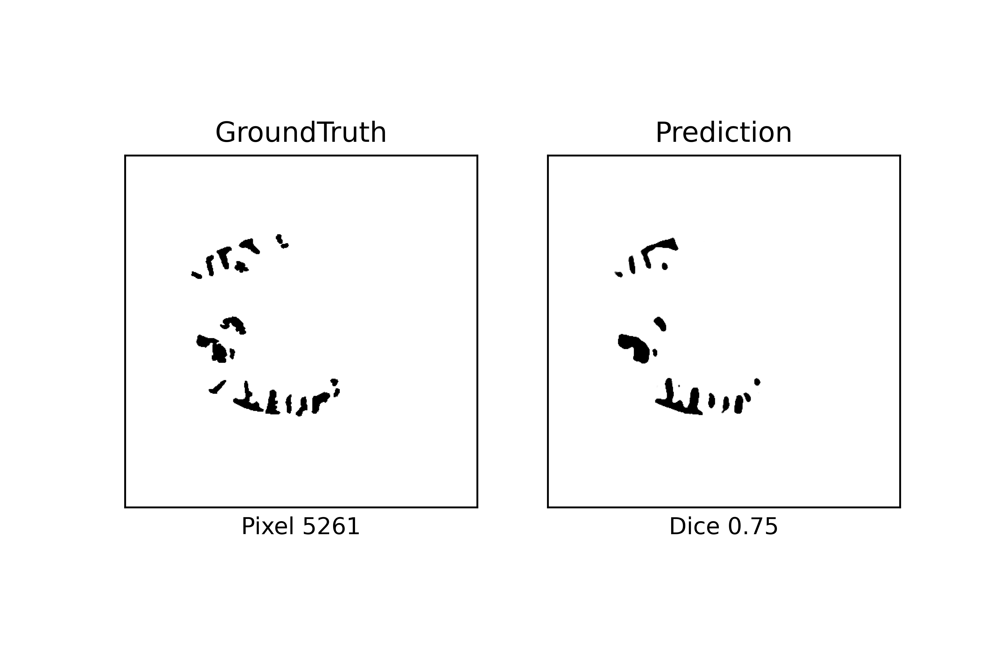

# Hematoma-Segmentation
A Deep Learning pipeline that segments hematoma from brain CTs for Biomedical &amp; Clinical Informatics Lab @umich

### Current Verion Implemented the Complete Proposed Model and Several Other Models:
original paper: https://doi.org/10.1016/j.artmed.2020.101910
<ol>
  <li>Multiview Level2</li>
  <li>Data Aug: Horizontal Flip, Elastic Transform</li>
  <li>Data Balancing: 1 Pos 1 Neg Sample Per Batch</li>
  <li>Mixed Loss: Weighted Dice with Random Contrast</li>
</ol>

### Directories:
1. The Training Configuration in ./util/config.py
2. Training Checkpoints Logs in ./outputs/

### To Run (on Greatlake Terminal) type:
	
	sbatch job.sh

### Proposed Result:

Multi-View Level2 with Mixed Loss: 0.675 Dice Score

### Achieved Max Result on Old Data:

Multi-View Level2 with Mixed Loss: 0.690 Dice Score

### Tested on New Data:

1. Patiten 1 Dice: 0.0011686086654663086
2. Patiten 2 Dice: 0.15188223123550415
3. Patiten 3 Dice: 0.5887980461120605
4. Patiten 4 Dice: 0.7884556651115417

Only Two Pixels of Hematoma the Model Cannot Detect

New Type of Hematoma the Model Failed Completely to Capture

Possible Noise in the New Data Label?

Under Estimation of the Hematoma

Good Estimation with Mistakes

